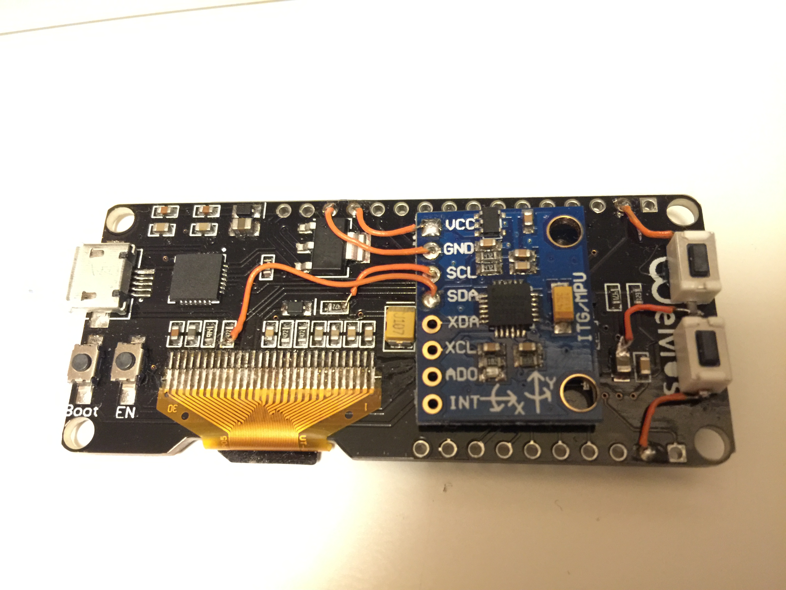

# Fuckin Balls

Sorry, ninja code. No comments.

You need to make this modification at your ESP32 PCB. 
Add two pushbuttons and a MPU6050 PCB

You have a Game of life, a calibration routine with the famous ZX-Spectrum character Sir Fred! and the Fuckin Balls.
I hope new improvements from you and a best collide routine :p
Enjoy!

## Licencia:
Copyright 2017 Alfredo Prado Vega
###### @radikalbytes 
http://www.radikalbytes.com
This work is licensed under the Creative Commons Attribution-ShareAlike 3.0
Unported License. To view a copy of this license, visit
http://creativecommons.org/licenses/by-sa/3.0/ or send a letter to
Creative Commons, PO Box 1866, Mountain View, CA 94042, USA.

